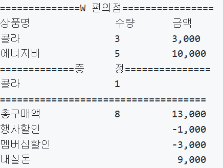

# javascript-convenience-store-precourse

### 🙏🏻 프리코스 4주차: 편의점

#### 💻 기능 요구사항 분석

1. 구매 물품 입력 받기

- 환영 인사와 함께 상품명, 가격, 재고, 프로모션 이름 안내 출력(재고 0개 -> `재고 없음`)
  - 구매가 처음이라면, 마크다운 파일에 작성되어 있는 데이터 추출 후 저장  
    ex:) `콜라(상품명) 1,000원(가격) 10개(재고) 탄산2+1(프로모션 이름)`
- 사용자가 구매할 상품명과 수량 입력 받기  
  ex:) `[사이다-2],[감자칩-1]`

2. 재고 확인

- 사용자가 입력한 상품의 수량 존재 여부 확인
  - 재고 부족 상품이 존재시: `[ERROR] 재고 수량을 초과하여 구매할 수 없습니다. 다시 입력해 주세요.`

3. 프로모션 확인

- 상품 중 프로모션 적용이 가능한 상품 존재 확인
  - 오늘 날짜가 프로모션 기간 내에 포함된 경우인지 확인
  - 프로모션 상품 재고를 우선적으로 차감, 부족할 경우 일반 재고 사용
- 적용 가능한 상품의 프로모션 재고 확인
  - 재고 부족시, 혜택 없이 정가로 결제할지 여부에 대한 안내 메시지 출력  
    `현재 {상품명} {수량}개는 프로모션 할인이 적용되지 않습니다. 그래도 구매하시겠습니까? (Y/N)`  
    Y: 일부 수량에 대해 정가로 결제한다.  
    N: 정가로 결제해야하는 수량만큼 제외한 후 결제를 진행한다.
- 적용 가능한 상품에 대해 고객이 해당 수량만큼 가져왔는지 확인
  - 가져오지 않았을 경우: `현재 {상품명}은(는) 1개를 무료로 더 받을 수 있습니다. 추가하시겠습니까? (Y/N)`  
    Y: 증정 받을 수 있는 상품을 추가한다.  
    N: 증정 받을 수 있는 상품을 추가하지 않는다.
  - 🤔2+1 상품을 1개만 가져왔을 땐, 따로 안내를 안해도 되는지?

4. 재고 계산

- 프로모션 등의 상황을 생각하고 재고를 재계산하여 저장

5. 멤버십 할인

- 멤버십 할인 적용 여부 확인  
  `멤버십 할인을 받으시겠습니까? (Y/N)`
  - 프로모션 미적용 금액의 30% 할인(프로모션 적용 후 남은 금액에 대해 할인 진행)
  - 멤버십 할인의 최대 한도 8,000원

6. 영수증 출력

- 구매 상품 내역, 증정 상품 내역, 금액 정보 출력
  

6. 추가 구매 여부 확인

- `감사합니다. 구매하고 싶은 다른 상품이 있나요? (Y/N)`
- 재 계산된 재고를 출력하며 1번부터 다시 진행

#### 💻 프로그래밍 요구 사항

- indent depth 3넘지 않기
- 3항 연산자 사용 금지
- else 지양
- 함수는 한 가지 일만 하도록 하기
- 함수의 길이 10라인 넘어가지 않도록 구현(줄바꿈 포함)
- 테스트 코드 작성
- 단위 테스트 작성
- 입출력을 담당하는 클래스 별도로 구현 `InputView` `OutputView`

```javascript
const InputView = {
  async readItem() {
    const input = await MissionUtils.Console.readLineAsync(
      '구매하실 상품명과 수량을 입력해 주세요. (예: [사이다-2],[감자칩-1])'
    );
    // ...
  },
  // ...
};
```

```javascript
const OutputView = {
  printProducts() {
    MissionUtils.Console.print('- 콜라 1,000원 10개 탄산2+1');
    // ...
  },
  // ...
};
```

### 예외처리

1. 사용자가 구매할 상품명과 수량 입력 받기

- 구매할 상품과 수량 형식이 올바르지 않는 경우: `[ERROR] 올바르지 않은 형식으로 입력했습니다. 다시 입력해 주세요.`
- 존재하지 않는 상품 입력한 경우: `ERROR] 존재하지 않는 상품입니다. 다시 입력해 주세요.`
- 재고 부족 상품이 존재시: `[ERROR] 재고 수량을 초과하여 구매할 수 없습니다. 다시 입력해 주세요.`
- 기타 잘못된 경우: `[ERROR] 잘못된 입력입니다. 다시 입력해 주세요.`
